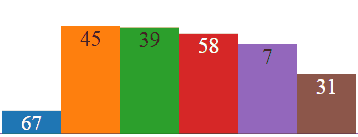
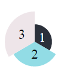

# minicharts.js: easily add mini animated charts

`minicharts.js` is a javascript library to add easily compact animated charts in an html page. This can be especially usefull when you want to include many similar charts in a limited space like a table, a map or a complex chart.


<div id="mychart">
</div>
<script src="minicharts.min.js"></script>
<script>
// Remove image
var images = document.getElementsByTagName("img");
for (var i = 0; i < images.length; i++) {
  if (images[i].src.indexOf("img/example.gif") != -1) {
    images[i].parentNode.removeChild(images[i]);
    break;
  }
}

var opts = {
  width:360,
  height:120,
  labels: "auto",
  maxValue: 100
};

function fakeData(n) {
  var res = [];
  for (var i = 0; i < n; i++) res.push(Math.random() * 100);
  return res;
}

var mychart = new minicharts.Barchart("#mychart", fakeData(6), opts);
setInterval(function(){mychart.setData(fakeData(6))}, 1000);
</script>

The full documentation is available [here](https://rte-antares-rpackage.github.io/minicharts/index.html).
You can also test the library on [JsFiddle](https://jsfiddle.net/fguillem/paar6yeg/).

## Usage

First include the script in your html pages:
```xml
<script src="https://unpkg.com/minicharts@0.1.1/dist/minicharts.min.js"></script>
```
This adds a global object called `minicharts`. Alternatively you can install the library with `npm` and use it with:
```javascript
var minicharts = require(minicharts);
```

Next add to your html an element that will contain the chart and that can be easily selected with a CSS selector. For instance:
```xml
<span id="mychart"></span>
```

In your javascript, create the desired chart:
```javascript
var mychart = new minicharts.Barchart("#mychart", [1, 2, 3]);
```


## Customize your charts
For now three chart types are available: [`Barchart`](https://rte-antares-rpackage.github.io/minicharts/Barchart.html), [`Piechart`](https://rte-antares-rpackage.github.io/minicharts/Piechart.html) and [`Polarchart`](https://rte-antares-rpackage.github.io/minicharts/Polarchart.html). Their constructor take the same parameters:
* A CSS selector
* An array containing values to represent
* An optional object containing graphical options for your chart like width, height, colors, etc.

Here is an example:
```javascript
var opts = {
  colors: ["#2B303A", "#92DCE5", "#EEE5E9"],
  width:100,
  labels: "auto",
  maxValue: 3 // Important if you want to compare charts
};
var mychart = new minicharts.Polarchart("#mychart", [1, 2, 3], opts);
```


## Update a chart

Charts object have methods `setData` and `setOptions` to update respectively data and graphical options. Here is the code use to generate the example at the top of the document:

```javascript
var opts = {
  width:360,
  height:120,
  labels: "auto",
  maxValue: 100
};

function fakeData(n) {
  var res = [];
  for (var i = 0; i < n; i++) res.push(Math.random() * 100);
  return res;
}

var mychart = new minicharts.Barchart("#mychart", fakeData(6), opts);
setInterval(function(){mychart.setData(fakeData(6))}, 1000);
```

## Contributing:

Contributions to the library are welcome and can be submitted in the form of pull requests to this repository.

## License Information:

Copyright 2015-2016 RTE (France)

* RTE: http://www.rte-france.com

This Source Code is subject to the terms of the GNU General Public License, version 2 or any higher version. If a copy of the GPL-v2 was not distributed with this file, You can obtain one at https://www.gnu.org/licenses/old-licenses/gpl-2.0.en.html.

The minicharts library includes code of other open-source libraries (full copies of the license agreements used by these components are in the LICENCE file):

- d3, https://github.com/d3/d3
- tinycolor2, https://github.com/bgrins/TinyColor
